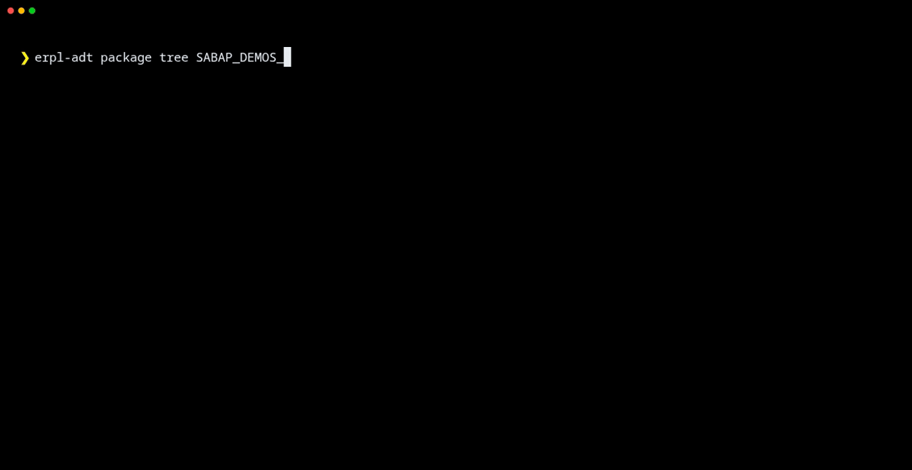
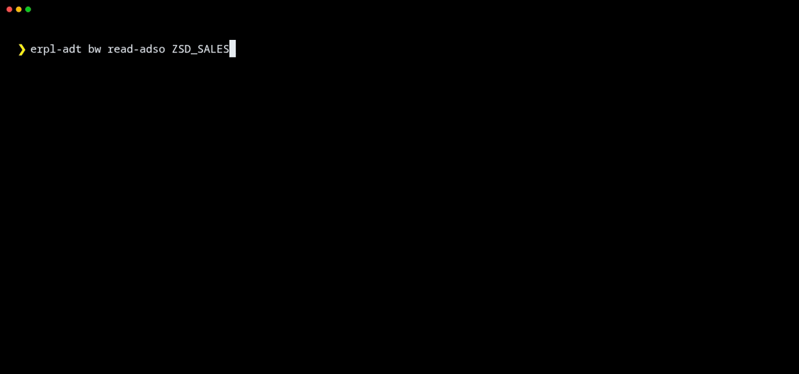
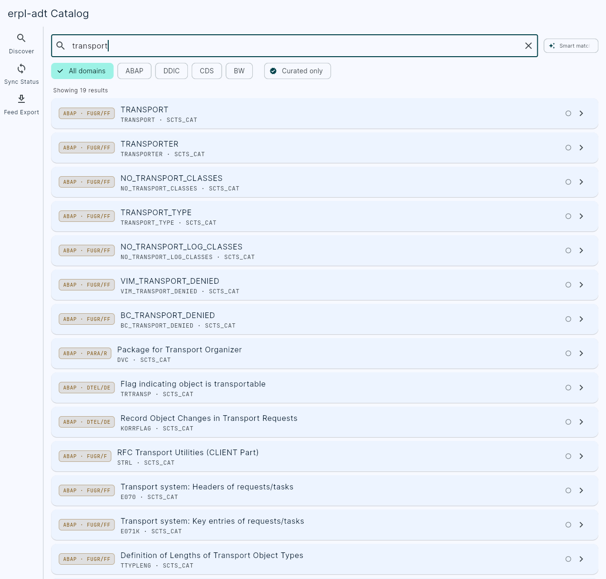

# erpl-adt

CLI and MCP server for the SAP ADT REST API — a single binary that talks the same HTTP endpoints Eclipse ADT uses. No Eclipse, no SAP NW RFC SDK, no JVM.

[](https://github.com/datazooDE/erpl-adt/actions/workflows/build.yaml)

Part of the [Datazoo](https://datazoo.de) ERPL family.

## What it does

- **Search and browse** ABAP objects, packages, data dictionary tables, CDS views
- **Read and write** source code with lock management and transport integration
- **Run tests** — ABAP Unit and ATC quality checks from the command line
- **Manage transports** — create, list, and release transport requests
- **MCP server** — expose all capabilities to AI agents over JSON-RPC (MCP 2025-06-18, negotiating down to 2024-11-05)

Every command accepts `--json` for machine-readable output.

## In action

Find ABAP objects by name pattern:


Read a data-dictionary table, with field types and check tables resolved:


Read ABAP source code with built-in syntax highlighting:


Browse a package recursively to enumerate everything it contains:



### BW/4HANA Modeling

Search the BW catalog across ADSOs, composite providers, DTPs, transformations, and queries:


Inspect an ADSO's field structure, complete with the InfoObject each field maps to:



Export an InfoProvider's dataflow as Mermaid — pipe it straight into a renderer or commit it next to the model:


## Quick examples

```bash
# Save connection credentials (prompts for password)
erpl-adt login --host sap.example.com --port 44300 --https --user DEVELOPER

# Search for classes matching a pattern
erpl-adt search ZCL_MY_* --type CLAS --max 20

# Connect in a specific logon language (descriptions come back translated)
erpl-adt --language DE search T000 --max 1     # -> description "Mandanten"

# Read object metadata and source code
erpl-adt object read /sap/bc/adt/oo/classes/zcl_my_class
erpl-adt source read /sap/bc/adt/oo/classes/zcl_my_class/source/main

# Write source code (auto-locks, writes, unlocks)
erpl-adt source write /sap/bc/adt/oo/classes/zcl_my_class/source/main --file impl.abap

# Write and activate in one step
erpl-adt source write /sap/bc/adt/oo/classes/zcl_my_class/source/main --file impl.abap --activate

# Activate an object by name
erpl-adt activate ZCL_MY_CLASS

# Run unit tests and ATC checks (by name or URI)
erpl-adt test ZCL_MY_CLASS
erpl-adt check ZCL_MY_CLASS --variant DEFAULT

# Create a transport request and release it
erpl-adt transport create --desc "Feature XYZ" --package ZPACKAGE
erpl-adt transport release NPLK900042

# Browse packages and data dictionary
erpl-adt package tree ZPACKAGE --type CLAS
erpl-adt ddic table SFLIGHT
erpl-adt ddic cds I_AIRLINE

# Check syntax
erpl-adt source check /sap/bc/adt/oo/classes/zcl_my_class/source/main
```

## Installation

The quickest way to run erpl-adt — no download needed:

```bash
uvx erpl-adt --help
```

Or install permanently:

```bash
pip install erpl-adt
```

Alternatively, download the binary for your platform from the [latest release](https://github.com/datazooDE/erpl-adt/releases/latest), or [build from source](#building-from-source).

| Platform | Architecture |
|----------|-------------|
| Linux    | x86_64      |
| macOS    | arm64, x86_64 |
| Windows  | x64         |

## Full reference

Run `erpl-adt --help` for the complete command listing. Key commands:

```
SEARCH — Search for ABAP objects
  search <pattern>                        Search for ABAP objects
      --type <type>                       Object type: CLAS, PROG, TABL, INTF, FUGR
      --max <n>                           Maximum number of results

OBJECT — Read, create, delete, lock/unlock ABAP objects
  object create                           Create an ABAP object
      --type, --name, --package           (required)
      --description, --transport
      --responsible <user>                Person responsible (default: logon user)
  object delete <uri>                     Delete an ABAP object
  object lock <uri>                       Lock an object for editing
  object read <name-or-uri>               Read object structure
  object run <class-name-or-uri>          Run an ABAP console class (IF_OO_ADT_CLASSRUN)
  object unlock <uri>                     Unlock an object

SOURCE — Read, write, and check ABAP source code
  source check <name-or-uri>              Check syntax
  source edit <name-or-uri>               Open source in $EDITOR and write back
  source read <name-or-uri>               Read source code
      --version <version>                 active or inactive (default: active)
      --section <section>                 main, localdefinitions, localimplementations, testclasses, all
      --color / --no-color                ANSI syntax highlighting
  source write <name-or-uri>              Write source code
      --file <path>                       Path to local source file  (required)
      --activate                          Activate the object after writing
                                          (not combinable with --handle: SAP
                                          refuses to activate a locked object)
      --optimistic                        Try lockless write first (pre-7.51 SAP)

ACTIVATE — Activate inactive ABAP objects
  activate <name-or-uri>

TEST / CHECK
  test <name-or-uri>                      Run ABAP unit tests
  check <name-or-uri>                     Run ATC quality checks
      --variant <name>                    ATC variant (default: DEFAULT)

TRANSPORT — List, create, and release transports
  transport create --desc <text> --package <pkg>
  transport list [--user <user>]
  transport release <number>

DATA DICTIONARY — Tables and CDS views
  ddic table <name>                       Get table definition (fetches lengths + descriptions by default)
      --no-resolve-types                  Skip data-element lookup; show field names and types only
      --raw                               Print raw SAP XML response
  ddic cds <name>                         Get CDS view source

PACKAGE — List contents and check package existence
  package exists <name>
  package list <name>
  package tree <name>                     Recursive BFS traversal
      --type <type>                       Filter: CLAS, PROG, TABL, INTF, FUGR
      --max-depth <n>                     (default: 50)

GLOBAL FLAGS
  --host, --port, --user, --password, --client
  --language <iso>                        SAP logon language (ISO, e.g. EN, DE; default: EN)
  --https, --insecure
  --json                                  Machine-readable JSON output
  --color / --no-color
  --timeout <sec>
  --session-file <path>                   Persist session for lock/write/unlock workflows
  -v / -vv                                INFO / DEBUG logging

EXIT CODES
  0  Success   1  Connection/auth/authorization   2  Not found   5  Activation error
  6  Lock conflict   7  Test failure   8  ATC check error   99  Internal error
```

## MCP server

erpl-adt includes a built-in MCP server (Model Context Protocol) that exposes all ADT operations as tools over JSON-RPC 2.0 on stdin/stdout. This lets AI agents search, read, write, test, and manage ABAP code directly. It negotiates 2025-06-18, 2025-03-26 or 2024-11-05 with the client, returns `structuredContent` as well as text, and annotates every tool as read-only, mutating or destructive.

```bash
erpl-adt mcp --host sap.example.com --port 44300 --https
```

Configure it in your MCP client (e.g., Claude Desktop, Claude Code):

```json
{
  "mcpServers": {
    "erpl-adt": {
      "command": "erpl-adt",
      "args": ["mcp", "--host", "sap.example.com", "--port", "44300", "--https"],
      "env": {
        "SAP_PASSWORD": "your_password"
      }
    }
  }
}
```

## Catalog

A unified, cross-domain (ABAP + DDIC + CDS + BW) metadata catalog, persisted in a single DuckDB file so search/lineage/where-used run in milliseconds instead of round-tripping SAP. Covers full-text + semantic (Gemini embeddings) hybrid search, end-to-end lineage stitching, a business-glossary overlay (definitions/owner/line-of-business/confidentiality) layered on top of the technical metadata, and incremental sync.

Every catalog command needs an explicit scope (`--package`/`--infoarea`) — there's no "catalog the whole system" default, because SAP has no call to enumerate every BW infoarea and ABAP/DDIC package search has no pagination, so a silent "everything" default risks quietly missing content past the result cap. Discover packages first with the regular `search` command:

```bash
erpl-adt search 'Z*' --type DEVC --json   # all custom-namespace packages
```

**Build** — `erpl-adt catalog build` always builds the feed; add `--db` to persist it, `--format` to render it differently, both, or neither:

```bash
erpl-adt catalog build --sid A4H --package ZMY_PACKAGE --infoarea ZBW_AREA
# -> just a summary, nothing is written anywhere

erpl-adt catalog build --sid A4H --package ZMY_PACKAGE --db catalog.duckdb
# -> persists into a DuckDB file (full rebuild, replaces any prior content) —
#    this is the file catalog search/annotate/sync/webui all read from

erpl-adt catalog build --sid A4H --package ZMY_PACKAGE --db catalog.duckdb --embed
# -> also computes embeddings for semantic/hybrid search (needs GEMINI_API_KEY)

erpl-adt catalog build --sid A4H --package ZMY_PACKAGE --format mermaid
erpl-adt catalog build --sid A4H --package ZMY_PACKAGE --format openmetadata
```

`catalog build --db` is a single-shot, all-or-nothing write with no progress output and no resume — fine for a small scope. For anything large (thousands of packages, an hour-plus run), use `catalog sync` instead, even for the very first build:

```bash
erpl-adt catalog sync catalog.duckdb --sid A4H --package ZMY_PACKAGE
# [1/1] package ZMY_PACKAGE (elapsed 0m4s, ETA 0s)   <- one progress line per item, on stderr

# interrupted (connection drop, auth expiry, Ctrl-C)? everything already synced is
# durably committed — pick up exactly where it left off instead of starting over:
erpl-adt catalog sync catalog.duckdb --sid A4H --package ZMY_PACKAGE --resume
```

Checkpoint/audit state (which items are done, whether the last attempt was interrupted) lives in the same DuckDB file as the catalog data — one artifact, no sidecar file to lose track of or leave behind. Removal detection (deleting entities that disappeared from the scope) only runs on a plain, non-resumed sync — a resumed run only sees the items it personally processed, not the whole scope's picture, so it skips removal rather than risk flagging a still-valid item as gone.

**Maintain:**

```bash
# Incremental sync — diffs against what's already stored, writes only the delta
erpl-adt catalog sync catalog.duckdb --sid A4H --package ZMY_PACKAGE

# Curate business context — optional; the catalog works fine without it.
# Technical metadata gives you the *what* (a table's fields); this adds the
# *why* a human would write: what an entity means, who owns it, how
# sensitive it is. Turns a search for "procurement spend" into a real hit
# on 0PUR_VALUE even before anyone remembers what that technical name means.
# Never touches SAP — only writes to catalog.duckdb's overlay columns.
erpl-adt catalog annotate catalog.duckdb --id <entity_id> \
    --definition "Total procurement value" --owner "jane@example.com" --lob Procurement
erpl-adt catalog annotate catalog.duckdb --file overlay.yaml   # bulk, keyed by entity_id
```

**View:**

```bash
# CLI — fast, cache-only, no SAP round-trip
erpl-adt catalog search catalog.duckdb "procurement value" --mode hybrid

# Web UI — search, browse, lineage, curate, sync status, feed export
erpl-adt catalog webui catalog.duckdb --port 8383   # then open http://127.0.0.1:8383/

# MCP — catalog_search/catalog_get/catalog_lineage/catalog_where_used/... for AI agents
erpl-adt mcp --catalog-db catalog.duckdb            # stdio
erpl-adt mcp --catalog-db catalog.duckdb --http     # JSON-RPC over HTTP
```

Both HTTP servers (`mcp --http` and `catalog webui`) refuse cross-origin browser requests
with 403 — a page you visit cannot post writes to your SAP system through them. Requests
without an `Origin` header (curl, native MCP clients), same-origin requests and loopback
origins are always allowed; add others with `--cors-origin`, and require a token with
`--auth-token` / `--auth-token-env`. See [docs/cli-usage.md](docs/cli-usage.md#http-transport-and-access-control).

The web UI ([`flutter/erpl_catalog_kit`](flutter/erpl_catalog_kit), compiled and embedded straight into the `erpl-adt` binary — see [Building from source](#building-from-source)) is **read-only against the cache except for curation**: Search, Browse, Entity Detail, Lineage, and Driver Tree all query the same fast `catalog_*` MCP tools the CLI and AI agents use; the Curate screen is the only one that writes, via `catalog_annotate`. There's no build/sync button — `catalog webui` doesn't hold a live SAP connection, so building, exporting, and syncing stay CLI-only operations. The Sync Status screen shows past sync runs and cache health, and Feed Export surfaces the exact `erpl-adt catalog build --format ...` command to run for each format, rather than re-implementing either client-side.



## Deploy workflow

erpl-adt also includes the original `deploy` workflow for automated abapGit package deployment via YAML configuration:

```bash
cat > config.yaml <<EOF
connection:
  host: localhost
  port: 50000
  use_https: false
  client: "001"
  user: DEVELOPER
  password_env: SAP_PASSWORD

repos:
  - name: flight
    url: https://github.com/SAP-samples/abap-platform-refscen-flight.git
    branch: refs/heads/main
    package: /DMO/FLIGHT
    activate: true
EOF

export SAP_PASSWORD=your_password
erpl-adt deploy -c config.yaml
```

The deploy workflow is an idempotent state machine: `discover → create package → clone → pull → activate`. Each step checks preconditions and skips if already satisfied. Re-running is safe. Supports multi-repo deployments with `depends_on` for topological ordering.

## Building from source

```bash
git clone --recurse-submodules https://github.com/datazooDE/erpl-adt.git
cd erpl-adt
make release
```

Requires CMake 3.21+, Ninja, and a C++17 compiler (GCC 13+, Apple Clang 15+, or MSVC 17+). vcpkg is included as a git submodule.

To also embed the [catalog web UI](#catalog) into the binary (optional — not required for the CLI/MCP server), build the Flutter client first, then rebuild:

```bash
make webui      # flutter build web — requires the Flutter SDK
make release    # picks up the build output and embeds it via CMakeRC
```

Without `make webui`, `erpl-adt catalog webui` still builds and runs, but serves an instructional message instead of the app.

To run the tests:

```bash
make test                          # Unit tests (offline, no SAP system needed)
make test-integration-py           # Integration tests (requires SAP system)
```

## Docker

```bash
docker build -t erpl-adt .
docker run --rm -v $(pwd)/config.yaml:/config.yaml \
    -e SAP_PASSWORD=your_password \
    erpl-adt deploy -c /config.yaml
```

Or use Docker Compose for end-to-end provisioning with a SAP ABAP Cloud Developer Trial:

```bash
docker compose up
```

## Feedback

If `erpl-adt` misbehaves or does something surprising, please
[open an issue](https://github.com/DataZooDE/erpl-adt/issues). ADT talks to real SAP
systems whose configurations we cannot reproduce here, so a report with your setup is
the fastest path to a fix — every human-readable error ends with that link for exactly
this reason.

If it saved you a trip through Eclipse, a star on the repo helps other people find it.

The first time you run `erpl-adt` interactively each day, a small banner says the same
thing. It never prints when output is piped, under `--json` or `--quiet`, or in CI.
Silence it with `DATAZOO_NO_BANNER=1`.

## Telemetry

erpl-adt collects anonymous, aggregate usage telemetry (feature usage, outcomes,
and durations) — never source code, object/package names, transport IDs, SAP
hosts/users, or error text. It is on by default and easy to disable:

```bash
erpl-adt --no-telemetry ...          # per invocation
export DATAZOO_DISABLE_TELEMETRY=1   # or DO_NOT_TRACK=1
```

See [TELEMETRY.md](TELEMETRY.md) for exactly what is collected and the privacy
contract.

## License

[Apache License 2.0](LICENSE) — Copyright 2026 Datazoo GmbH
